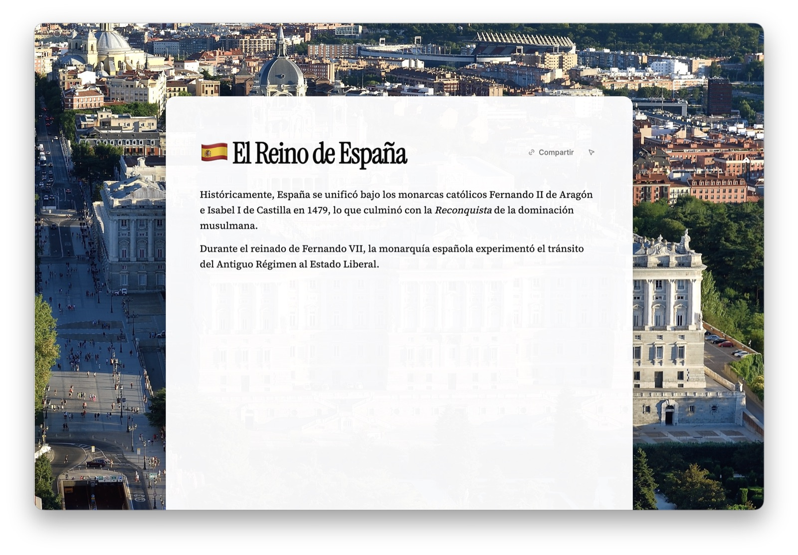
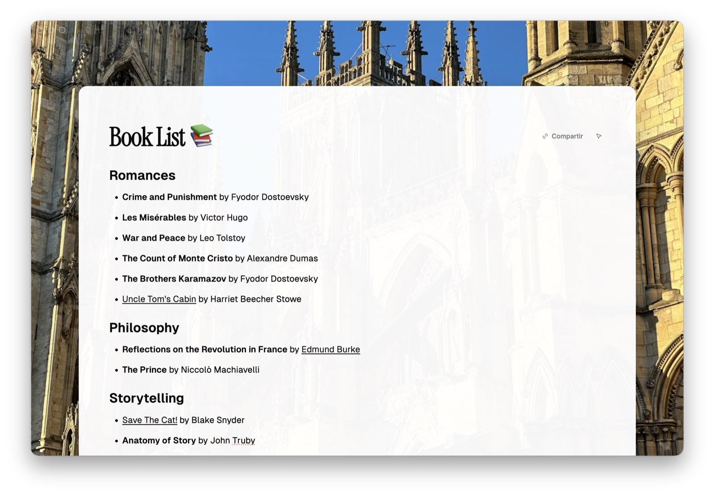

<div align="center">
  
  <h1>madrid</h1>
  <p>Quiet Mac notes. Think without the feed.</p>
  <p>
    <a href="https://getmadrid.app">getmadrid.app</a>
    ·
    <a href="https://app.getmadrid.app">app.getmadrid.app</a>
    ·
    <a href="https://github.com/mrlemoos/madrid/releases/latest">Mac download</a>
  </p>
</div>


## Why it exists

You open a notes app to think, and the product starts performing: offering, suggesting, nudging, until there is less room for your own pace. Useful automation belongs elsewhere. In a notes app, that itch to always do something next mistakes motion for thinking.

[Madrid](https://getmadrid.app) treats attention as something to protect, not harvest. It gives you a steady place to write and link ideas, then steps back when you pause. Your mind can wander, revise, wait for the right phrase. The software does not entertain the lull.

Silence is left alone on purpose. Boredom at the cursor is a thought catching up.

## Screenshots

<p align="center">
  
</p>

<p align="center">
  
</p>

<p align="center">
  
</p>

## What it is

Madrid is a Mac-first personal notes app. Install from [GitHub Releases](https://github.com/mrlemoos/madrid/releases/latest), sign in, subscribe in Settings. There is no free tier and no trial. Guide prices are $2.49/month or $19.49/year (USD); checkout shows the local charge. The hosted vault at [app.getmadrid.app](https://app.getmadrid.app) is the same product when you are not on a Mac.

Features exist to keep that surface quiet:

- **Editor.** TipTap rich text: headings, lists, tasks, tables, code, Mermaid, emoji via the palette (⌘K), not a toolbar parade.
- **Links.** Type `@` for internal note links, backlinks, and an optional note graph.
- **Folders.** Coloured sidebar folders.
- **Journal / today’s note.** Dated entries; optional ⌘D with a local long-date title and no streaks.
- **Offline-first.** Local vault (Yjs + IndexedDB); sync and backup when you are subscribed and online.
- **Attachments.** Inline PDFs and images; note banners.
- **Link previews.** A URL on its own line can become an OG card.
- **Assistive capture.** Record, transcribe into blocks you edit. Not ghostwriting.
- **Share.** Public share cards at `/s/[token]`.
- **Desktop.** Electron macOS shell with auto-update. Packaged builds load the hosted app.

## Monorepo

This repository is an [Nx](https://nx.dev) workspace.

| Path                                         | Purpose                                                              |
| -------------------------------------------- | -------------------------------------------------------------------- |
| [`apps/nota`](apps/nota)                     | Next.js App Router client + same-origin API routes (`src/app/api/*`) |
| [`apps/nota-electron`](apps/nota-electron)   | Electron macOS shell                                                 |
| [`apps/nota-marketing`](apps/nota-marketing) | Astro marketing site                                                 |
| [`packages/`](packages)                      | Feature libs (`notes-chrome`, editor, offline/Yjs, design, i18n, …)  |
| [`supabase/migrations`](supabase/migrations) | Postgres schema, RLS, Clerk third-party auth                         |

Stack: React 19, TipTap / ProseMirror, Yjs local-first, Supabase (Postgres + Storage + RLS), Clerk (sign-in + Billing), Vitest, pnpm.

Packaged Electron does not embed a local web build. It loads `https://app.getmadrid.app`. Local Electron expects the Next dev server at `http://localhost:3000`.

## Requirements

- Node.js 22+ (see root `package.json` `engines`)
- pnpm 10.x (see `packageManager` in [`package.json`](package.json))

## Install

```sh
corepack enable pnpm
pnpm install
```

## Environment

Copy [`apps/nota/.env.example`](apps/nota/.env.example) to `apps/nota/.env`.

Minimum to run the app:

- `NEXT_PUBLIC_CLERK_PUBLISHABLE_KEY`
- `CLERK_SECRET_KEY` (server-only)
- `NEXT_PUBLIC_SUPABASE_URL`
- `NEXT_PUBLIC_SUPABASE_ANON_KEY`
- `SUPABASE_SECRET_KEY` (server-only)

Never prefix secrets with `NEXT_PUBLIC_`. Never commit real values. The example file also lists optional keys for semantic search, assistive capture (xAI), flight lookup, PostHog, and Stripe. Env vars alone do not create the database; apply SQL from this repo in Supabase (including [`0008_clerk_third_party_auth.sql`](supabase/migrations/0008_clerk_third_party_auth.sql) for Clerk third-party auth).

## Database

Migrations live under [`supabase/migrations/`](supabase/migrations/). With the [Supabase CLI](https://supabase.com/docs/guides/cli), link the project and push, or run `supabase start` locally.

## Run

```sh
# notes + marketing + Electron (where applicable)
pnpm run dev

# notes only: http://localhost:3000
pnpm exec nx dev @getmadrid/nota

# marketing
pnpm exec nx run @getmadrid/nota-marketing:dev

# Electron only (start notes on :3000 in another terminal, or use pnpm run dev)
pnpm run electron:dev
```

More Electron detail: [`apps/nota-electron/README.md`](apps/nota-electron/README.md).

## Build and test

```sh
pnpm exec nx build @getmadrid/nota
pnpm exec nx test @getmadrid/nota
pnpm test    # nx run-many -t test
pnpm run lint
pnpm run format
```

## Licence

Apache License 2.0. See [`LICENSE`](LICENSE).
